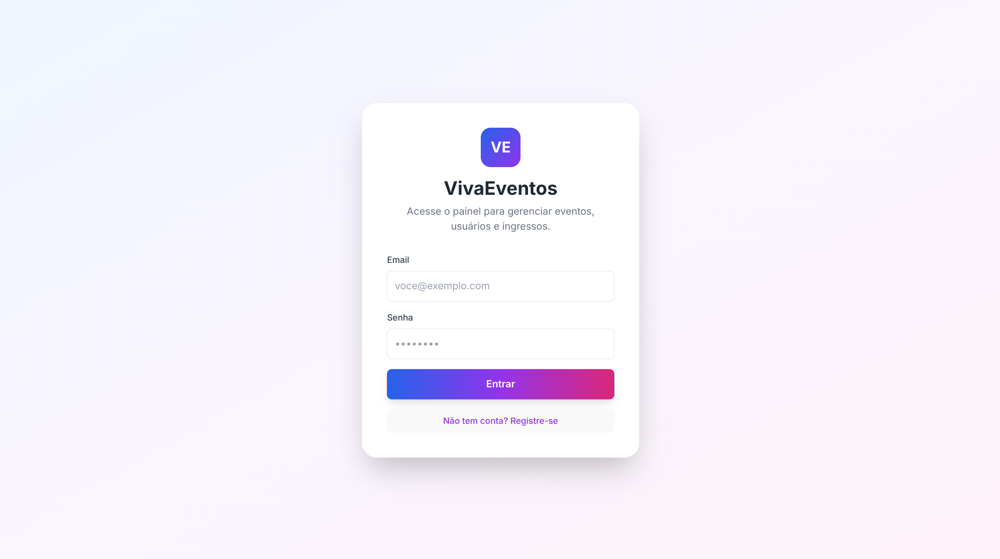
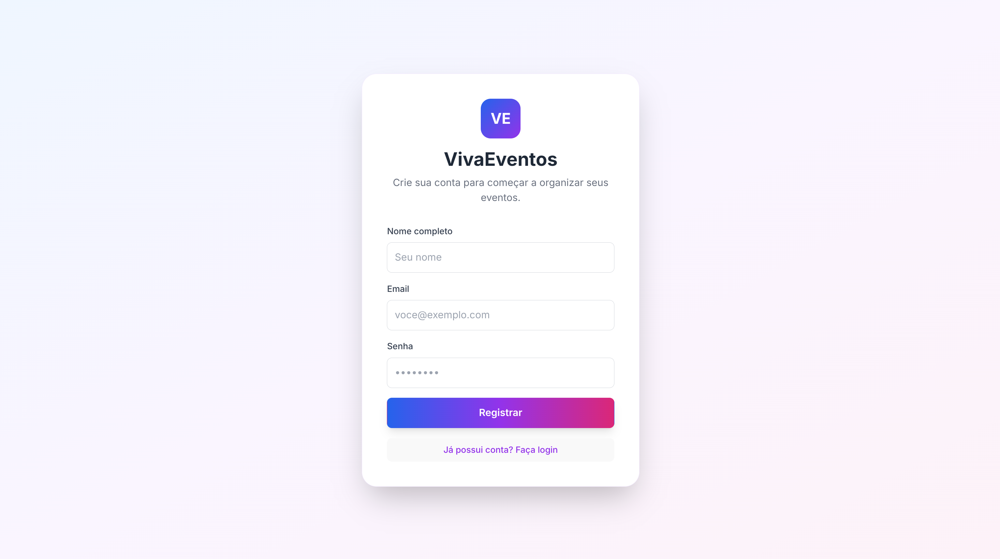
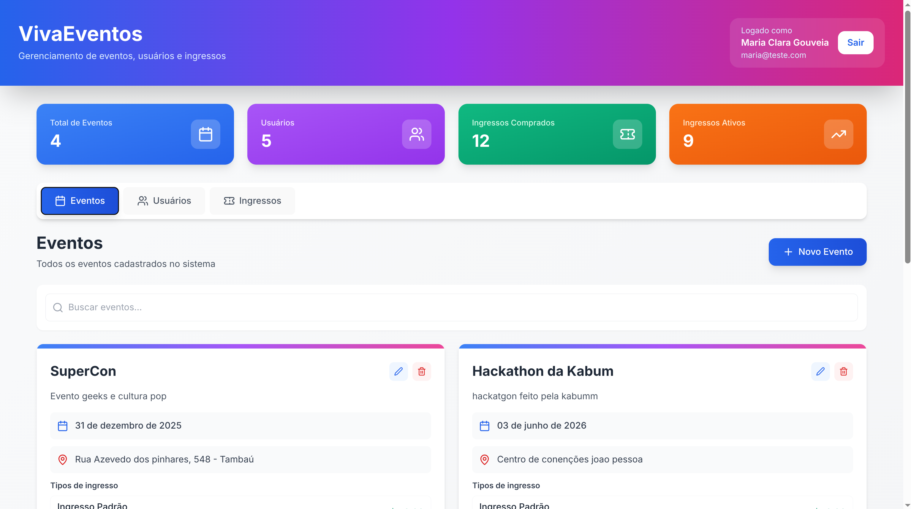
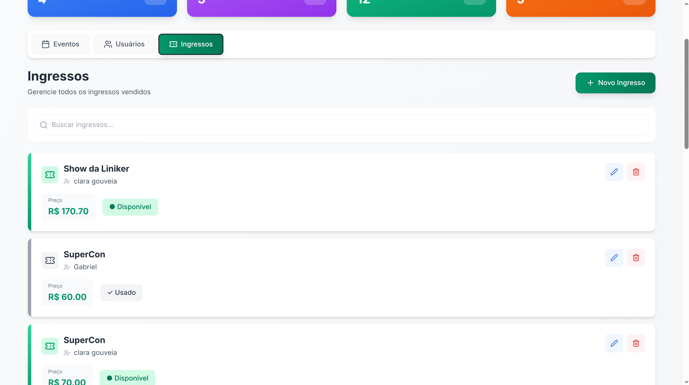
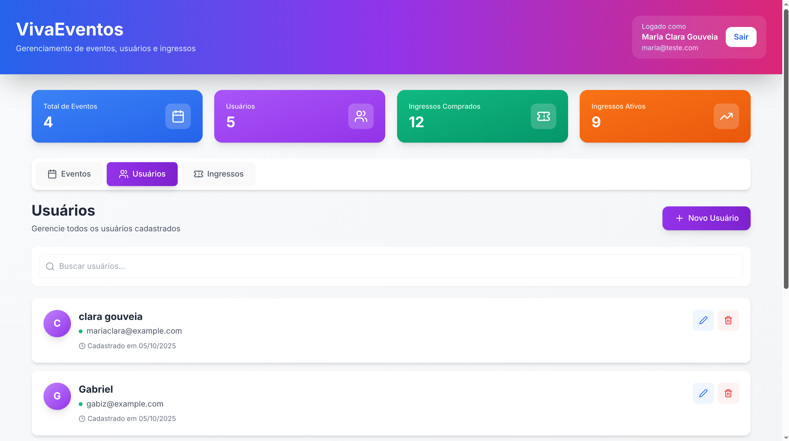
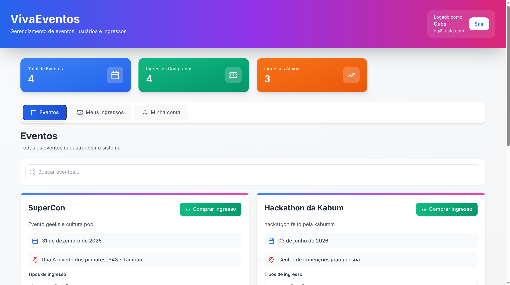
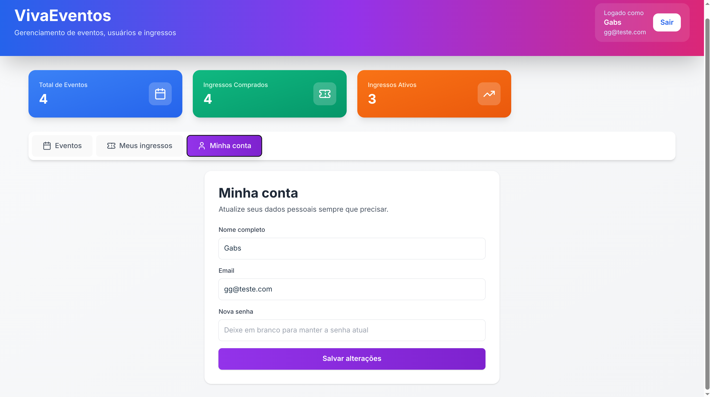

# EventOrganization

API e frontend para gerenciamento de eventos com múltiplos tipos de ingresso, painel administrativo e vendas.

## Tecnologias

- Node.js + Express
- Prisma ORM + PostgreSQL
- React (Vite) para o painel web
- Swagger para documentação da API

## Pré-requisitos

- Node.js >= 18
- PostgreSQL 14+

## Configuração

1. Clone o repositório e instale dependências:
   ```bash
   npm install
   cd frontend-eventos && npm install
   ```
2. Configure o arquivo `.env` na raiz com `DATABASE_URL`, `PORT` e `JWT_SECRET`.
3. Execute as migrações e gere o Prisma Client:
   ```bash
   npx prisma migrate dev
   npx prisma generate
   ```

## Executando

```bash
# Backend
npm run dev

# Frontend
cd frontend-eventos
npm run dev
```

O Swagger fica disponível em `http://localhost:3000/api-docs`.

## Fluxos principais

- Administradores podem:
  - Criar/editar/deletar eventos com múltiplos tipos de ingresso (nome, preço, quantidade).
  - Gerenciar usuários e ingressos.
  - Criar ingressos para qualquer usuário escolhendo o tipo.
- Usuários comuns podem:
  - Visualizar eventos disponíveis.
  - Comprar ingressos escolhendo o tipo e a quantidade (respeitando disponibilidade).
  - Visualizar e “usar” ingressos, gerando um código aleatório.

Toda a entrada de dados passa por validações com **Zod** (camadas backend e frontend), garantindo payloads consistentes e mensagens de erro claras.

## Telas do frontend

### Login/Registro
- Tela inicial; o primeiro usuário cadastrado se torna admin automaticamente. Permite alternar entre login e criação de conta.



### Usuário Administrador
- Podem criar/editar/deletar eventos e configurar múltiplos tipos de ingresso.
- Podem ver todos os usuários alterar nome e email.
- Tem cards dizendo a quantidade de eventos, usuários, ingressos comprados e ingressos ativos(não usados).
 <br>
 <br>


### Usuários 
- Visualizam eventos em aberto, podem comprar ingressos, vizualizar os ingressos e usá-los.
- Ao usar um ingresso é gerado um código de validação. depois de usado, o código não aparece mais.
- Podem alterar suas credenciais.
<br>
<br>


## Comandos úteis

- `npx prisma studio` — abrir o Prisma Studio para inspecionar o banco.
- `npm run build` — compilar a API (ajuste as configurações TypeScript se necessário).
- `npm run lint` no frontend — executar o ESLint do Vite.
